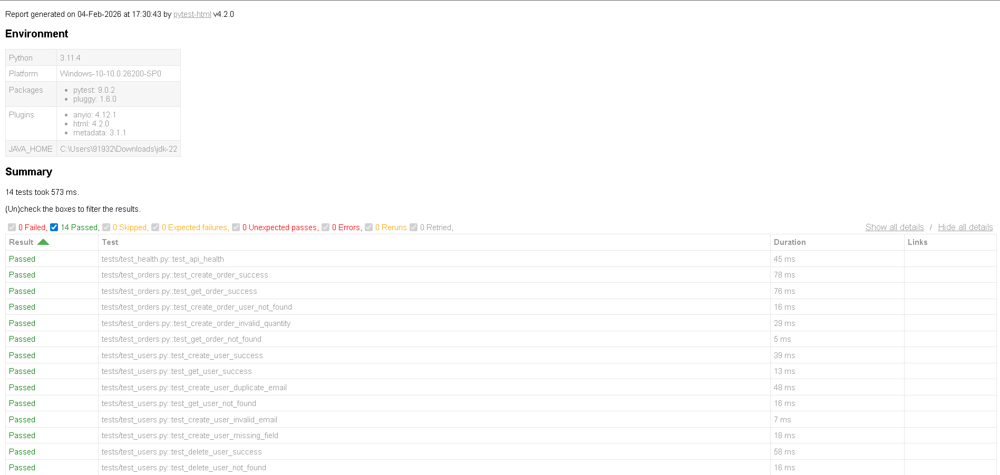

API Automation Project

Automated testing framework for a FastAPI-based User & Order Management API. Includes API tests for creating, fetching, and deleting users and orders using Pytest, with reusable fixtures, logging, and HTML reports.

🚀 Features

Automated API testing using Pytest.

Positive & negative test cases for Users and Orders.

Reusable API client (client/api_client.py) for making HTTP requests.

Fixtures for test data setup and cleanup (conftest.py).

HTML test reports using pytest-html.

Centralized logging with utils/logger.py.

📂 Project Structure
api-automation-project/
│
├── app.py                   # FastAPI application
├── models.py                # Pydantic models
├── conftest.py              # Pytest fixtures
│
├── client/
│   └── api_client.py        # Custom API client for requests
│
├── tests/
│   ├── test_users.py        # User tests
│   ├── test_orders.py       # Order tests
│   └── test_health.py       # API health check
│
├── utils/
│   └── logger.py            # Logging utility
│
├── config/
│   └── config.yaml          # Base URL configuration
│
├── reports/                 # Pytest HTML reports
│
└── README.md

🛠️ Prerequisites

Python 3.11 (or compatible)

FastAPI, Uvicorn, Pytest, Pytest-HTML, Requests, Pydantic

Install dependencies:

pip install -r requirements.txt

⚡ Setup

Clone the repo:

git clone <repo-url>
cd api-automation-project

Create & activate virtual environment:

python -m venv venv
# Windows
venv\Scripts\activate
# macOS / Linux
source venv/bin/activate

Install dependencies:

pip install -r requirements.txt

Run the FastAPI app:

uvicorn app:app --reload

✅ Running Tests

Run all tests:

pytest -v

Generate an HTML report:

pytest -v --html=reports/report.html

Sample HTML report:

Fixtures: Use api_client or create_test_user from conftest.py for reusable API calls in tests.

📝 Notes

Make sure the FastAPI server is running before executing tests.

Base URL is configured in config/config.yaml.

Logs are available via utils/logger.py.

HTML reports are saved in the reports/ folder after test runs.

🧪 Test Coverage

Users

Create user (positive & negative)

Fetch user by ID

Delete user

Invalid/missing fields & duplicate emails

Orders

Create order for a user

Fetch order by ID

Invalid user or quantity

Fetch non-existent order

API Health

Basic API health endpoint check